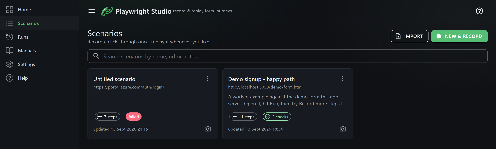
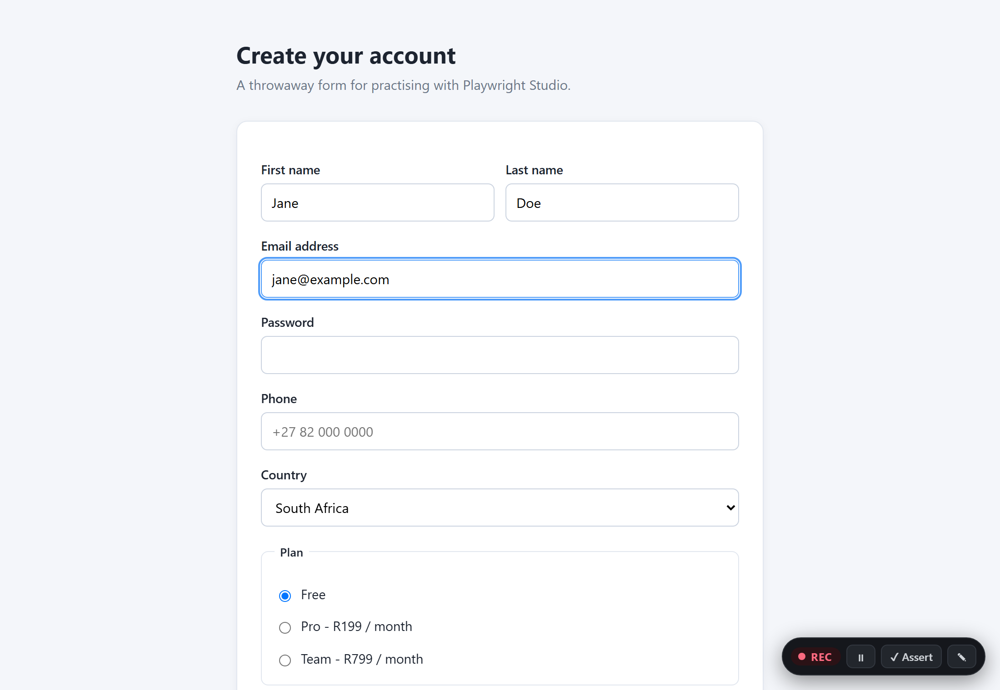
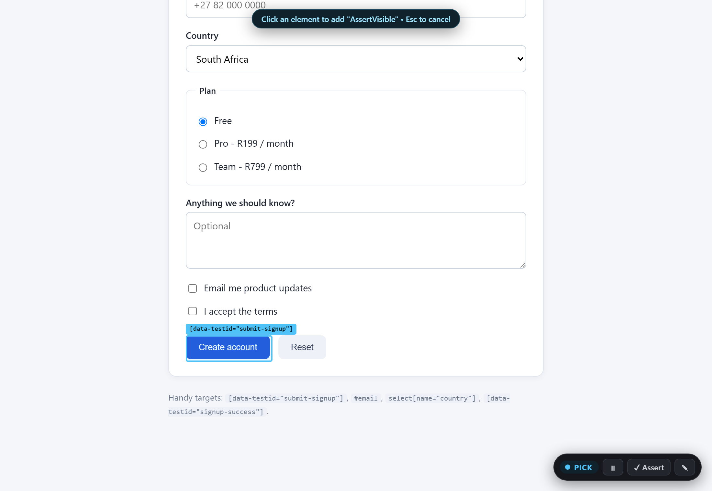
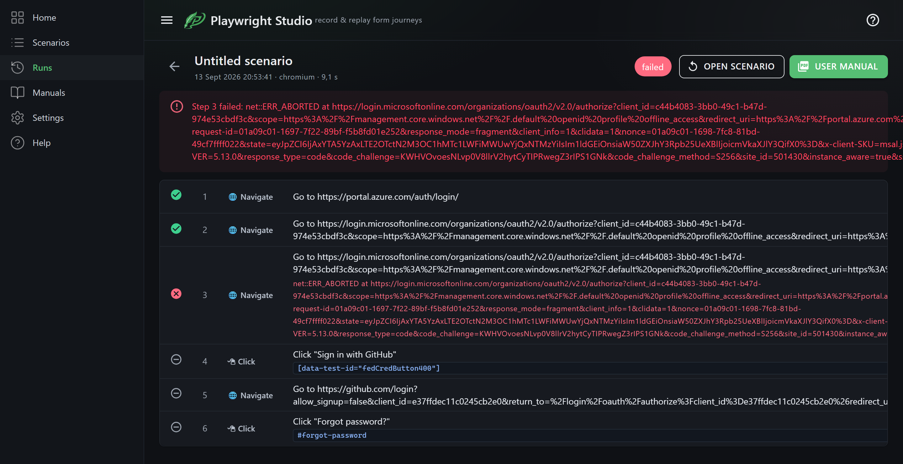
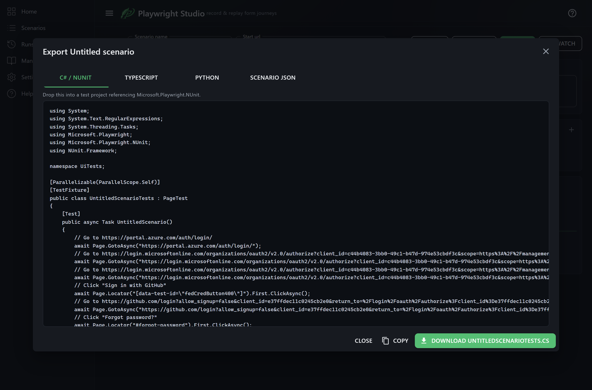

# Playwright Studio

Record a click-through of a web form once. Replay it whenever you like, watch it happen, and turn
it into a printed user manual — or export it as a real test file for your suite.

A local Blazor Server app wrapped around [Playwright](https://playwright.dev). Nothing leaves your
machine.



---

## Why

Playwright's own `codegen` records a script and hands you code. That's great once, and painful
afterwards: the moment a selector rots you're back in the generated file, guessing which line broke
and why.

Playwright Studio keeps the journey as **data** you can read and edit — a list of steps, each with
an action, a selector, and the alternatives the recorder considered. When something breaks, the run
tells you whether the element was missing, invisible, covered by something, or inside an iframe that
never appeared, and you fix it in one field instead of rewriting a script.

And because every step carries a screenshot and a description, the same recording doubles as a
**user manual**.

## What you get

| | |
| --- | --- |
| **Record** | A real browser opens with a REC toolbar. Click, type, tick, choose — every action becomes a step. Typing collapses into one `Fill` per field, not one step per keystroke. |
| **Assert** | Pick an element on the page and record a check: visible, hidden, its text, its value, its checked state. |
| **Replay** | Run headless for an answer, watch it happen, or run it *inside the browser you are already using* — with a Stop button on the page, so you can let it fill a form to a point and carry on by hand. |
| **Repair** | A failing step says *why* — nothing matched, nothing visible, something covered the click, the frame never appeared. Selectors the recorder rejected are kept and tried automatically. |
| **Export** | NUnit C#, `@playwright/test` TypeScript, or pytest — runnable files, with variables as real constants. |
| **Document** | Draft a manual from any run, rewrite the wording, swap in your own screenshots, download a PDF. |

## Quick start

Requires the [.NET 10 SDK](https://dotnet.microsoft.com/download).

```bash
git clone https://github.com/<you>/playwright-studio.git
cd playwright-studio
dotnet run --project src/PlaywrightStudio
```

Then open <http://localhost:5050>.

The first launch seeds one worked example — **Demo signup – happy path** — pointed at a practice form
the app serves itself. Open it and press **Run** to see the whole chain work before recording
anything of your own.

### Browsers

Playwright normally ships its own browser builds, but the studio can drive one you already have.
In **Settings → Browser**:

- **Microsoft Edge** or **Google Chrome** — uses what's installed. No download.
- **Chromium / Firefox / WebKit** — Playwright's own builds. Press **Install** in Settings, or run
  `playwright.ps1 install` from the build output.

## How it works

The interesting part is the recorder. There's no browser extension and no patched build:

1. A headed browser is launched through Playwright.
2. [`Assets/recorder.js`](src/PlaywrightStudio/Assets/recorder.js) is injected into **every**
   document with `AddInitScriptAsync`, so it survives navigation and reaches iframes.
3. It listens in the capture phase, builds a ranked list of selector candidates for whatever you
   touched, and posts steps back through an `ExposeBindingAsync` channel.
4. Its toolbar lives in a **shadow root**, so it can't inherit the page's styles — and clicking it
   never produces a step.

### Selectors

For each element, candidates are generated and **only those matching exactly one element** survive:

| Priority | Example | Why |
| --- | --- | --- |
| 1 | `[data-testid="save"]` | Put there to be tested against. Also `data-test`, `data-qa`, `data-cy`, `data-automation-id`. |
| 2 | `#email` | An id a person chose. |
| 3 | `input[name="plan"][value="pro"]` | Form attributes — also `aria-label`, `placeholder`. |
| 4 | `role=button[name="Save"]`, `text="Save"` | What the user sees. Survives a redesign. |
| 5 | `#mudinput08267ls7` | A framework-generated id. Works today, gone next render. |
| 6 | `form > div:nth-child(3) > input` | A css path. Last resort. |

Generated ids rank *below* role and text deliberately — MudBlazor's `#mudinput08267ls7` is the
classic trap. Every rejected candidate is stored on the step, and the runner falls back to them
automatically if the primary stops matching.

### Surviving replay

The page you replay against is never quite the page you recorded, so the runner closes the common
gaps: it acts on the first **visible** match rather than the first in the markup, follows tabs the
journey opens, accepts `confirm()` dialogs, falls back from an option's value to its label, and
names the element covering a click it couldn't make.

## Screenshots

| Recording | Picking an assertion |
| --- | --- |
|  |  |

| Run report | Export |
| --- | --- |
|  |  |

A fuller walkthrough lives in [docs/user-guide.html](docs/user-guide.html).

## Where your data lives

`%LOCALAPPDATA%\PlaywrightStudio` by default — change it in **Settings → Where things are stored**,
which can copy your existing scenarios across for you.

```
settings.json
tools/ffmpeg/            downloaded on demand, for mp4 video
scenarios/<id>.json      one file per scenario - readable, diffable, committable
runs/<timestamp>/        results, screenshots, trace.zip
manuals/<id>/            written manuals and their pictures
```

Run **videos** and page **captures** land next to the app instead. All three locations can also be
set in `appsettings.json` via `Studio:DataRoot`, `Studio:VideoFolder` and `Studio:CaptureFolder`;
`Studio:DataRoot` wins over the in-app setting.

Scenario files are plain JSON, so committing them next to the app they test works well.

## Known limits

- A **cross-origin iframe** can't see the `<iframe>` tag holding it, so the recorder names it by its
  own `name` or url. A frame with neither falls back to the first iframe on the page.
- **File uploads** record the file's *name*; set the full path on the step before replaying.
- **Canvas** and custom-drawn widgets have nothing to select.
- **One recording at a time** — the studio owns a single browser.
- **Video** needs a real ffmpeg. The one Playwright bundles has no mp4 muxer; Settings can fetch a
  static build on demand.
- **Video and traces** are not captured when running inside your own browser — that mode attaches to
  a browser it didn't launch.

## Security

The studio binds to localhost and is built for single-user local use. It reads and writes your
filesystem (the folder picker browses your drives) and, when you switch it on, attaches to a browser
with remote debugging enabled. **Don't expose it on a network interface.**

Recorded passwords are lifted into a scenario variable so the step reads `{{password}}` rather than
the secret — but the value is still stored in plain text in the scenario JSON. Blank it before
committing or sharing the file.

## Contributing

Issues and pull requests welcome — see [CONTRIBUTING.md](CONTRIBUTING.md).

## Licence

[MIT](LICENSE).

Built on [Playwright](https://github.com/microsoft/playwright-dotnet) (Apache-2.0),
[MudBlazor](https://github.com/MudBlazor/MudBlazor) (MIT) and
[Markdig](https://github.com/xoofx/markdig) (BSD-2-Clause).

> **A note on ffmpeg.** Video is optional and off by default. If you enable it, the studio can
> download a **GPL** build of ffmpeg and invoke it as a separate process. That binary is not
> distributed with this project and is not linked into it — but if you redistribute a bundle that
> includes it, the GPL applies to that bundle.
